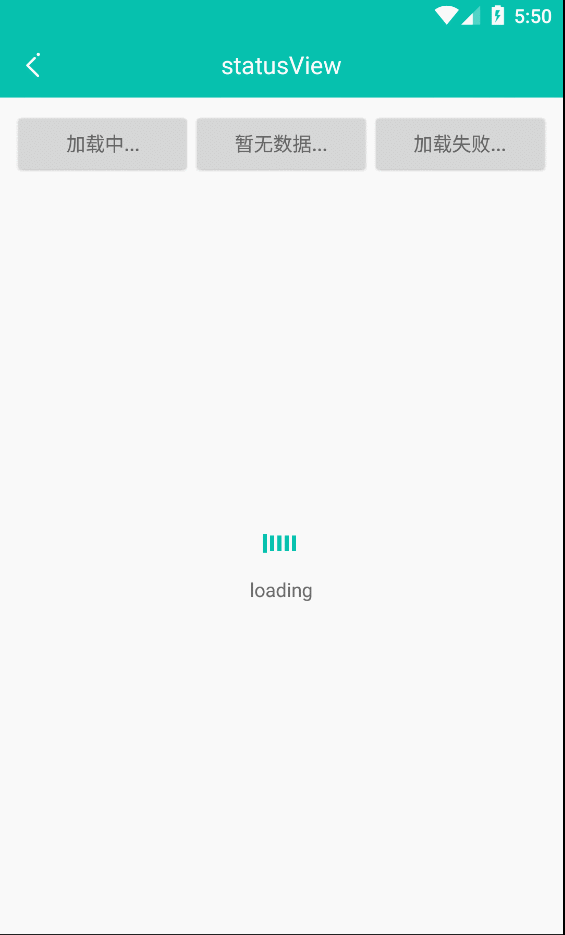
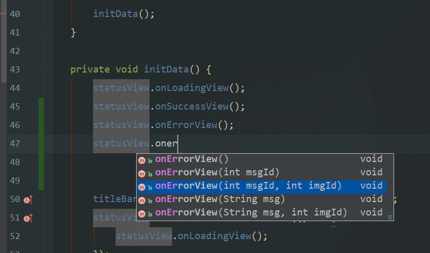

# ZAndroidLib
android开发库，里面将会包含常用的View，常用的工具类等等

## 库引入
1. 先在 build.gradle(Project:XXXX) 的 repositories 添加

        allprojects {
            repositories {
                ...
                maven { url 'https://jitpack.io' }
            }
        }
  
 2. 然后在 build.gradle(Module:app) 的 dependencies 添加
  
          dependencies {
                compile 'com.github.zhouxianling:ZAndroidLib:v1.5.4'
        }
  
  ## 介绍
  
  ### 在使用之前你必须先初始化
  
       
        public class App extends Application {
            @Override
            public void onCreate() {
                super.onCreate();
                //使用工具类必须先初始化
                LTool.init(this);
        
            }
        }
   
 
 ## 自定义View部分
 
   + **LTitleBarView通用标题**
   
  
 1. 效果
 
 
 
2. xml使用

        <com.zxl.zlibrary.view.LTitleBarView
                android:id="@+id/titleBar2"
                android:layout_width="match_parent"
                android:layout_height="48dp"
                android:layout_marginTop="10dp"
                android:background="@color/text_gray"
                app:leftText="返回"
                app:leftTextVisibility="true"
                app:rightIconVisibility="true"
                app:rightText="设置"
                app:rightTextVisibility="true"
                app:title="通用标题" />
 
3. 属性

        <declare-styleable name="LTitleBarView">
                <attr name="title" format="string" />
                <attr name="titleColor" format="color" />
                <attr name="titleSize" format="dimension" />
                <attr name="titleVisibility" format="boolean" />
                <attr name="leftText" format="string" />
                <attr name="leftTextColor" format="color" />
                <attr name="leftTextSize" format="dimension" />
                <attr name="leftTextVisibility" format="boolean" />
                <attr name="rightText" format="string" />
                <attr name="rightTextColor" format="color" />
                <attr name="rightTextSize" format="dimension" />
                <attr name="rightTextVisibility" format="boolean" />
                <attr name="leftIcon" format="reference" />
                <attr name="leftIconVisibility" format="boolean" />
                <attr name="rightIcon" format="reference" />
                <attr name="rightIconVisibility" format="boolean" />
            </declare-styleable>
  
 + LStatusView页面状态
  
1. 效果

 
2. xml使用 （//注意只能有一个子控件）
  
            <com.zxl.zlibrary.view.statusview.LStatusView
                android:id="@+id/statusView"
                android:layout_width="match_parent"
                android:layout_height="match_parent">
        
                <FrameLayout
                    android:layout_width="match_parent"
                    android:layout_height="match_parent">
        
        
                </FrameLayout>
        
            </com.zxl.zlibrary.view.statusview.LStatusView>

                   
 3. 属性
 
           <declare-styleable name="LStatusView">
                  <!-- 错误提示图标 -->
                  <attr name="errorImg" format="reference" />
                  <!-- 错误提示文字 -->
                  <attr name="errorText" format="string" />
                  <!-- 空数据提示图标 -->
                  <attr name="emptyImg" format="reference" />
                  <!-- 空数据提示文字 -->
                  <attr name="emptyText" format="string" />
                  <!-- 加载提示文字 -->
                  <attr name="loadingText" format="string" />
              </declare-styleable>
   
4. 方法

+ ClearEditText带清除功能的输入框

         待完善

+ LCheckBox自定义checkbox

        待完善

## 工具类部分说明
        
        LDensityTool // 单位转换工具类
        LogTool  //log打印工具
        LToast  //吐司工具
        LCacheTool    //缓存相关工具类
        LEmptyTool  //对象判空工具类
        LFileIOTool  //IO读写工具类
        LFileTool  //文件操作工具类
        LImageTool  //图片处理相关工具类
        LNetworkTool //网络先关工具类
        LRegeTool  //正则工具类
        LScreenTool  //屏幕相关工具类
        LStatusBarTool  //状态栏工具类
        LTimeTool  //处理时间工具类
        LKVTool  //KV是一个简单的key-value存取类，对SharePreference进行了封装。
        LLoginControl    //通过SharePreference对账号密码进行保存。
        LActivityTool //Activity相关工具类
